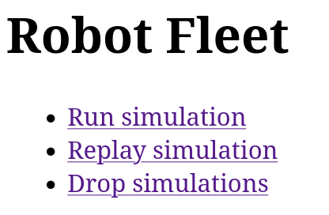
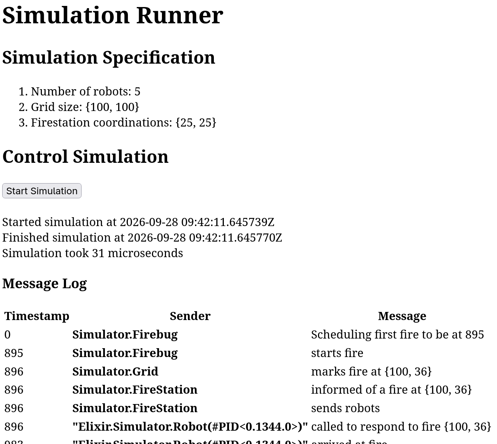
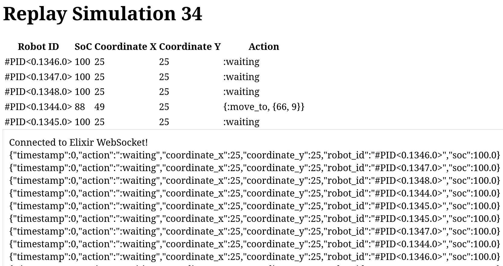

# FireBot Sim

A fire-fighting autonomous robot simulation, with a simple data-gathering
backend and a frontend to monitor the fleet of robots.

## System Components

The system is comprised of two major components: A PostgreSQL database to hold telemetry and
simulation information, and an [Elixir](https://elixir-lang.org/) monolith which serves as
the frontend, backend, and a discrete event simulation.

### The Elixir Applications

The monolith is split into three separate applications, which run in the same virtual machine for simplicity.

#### The `ui`

`ui` is the system's frontend, which offers three simple interactions: start a
simulation, replay it, or delete all simulation runs:



The `/simulate` route is used to trigger a simulation with pre-defined
parameters. The parameters are currently hard-coded in the software (see
`Simulator.Config`). After triggering a simulation run, the events of the simulation
are streamed through a websocket to the UI and displayed as soon as they arrive.



To replay a simulation and display it "in real-time" with the `ui` dashboard, navigate to
`/replay`. A list of robots is displayed at the top with their current location, state of charge,
and action. Telemetry is also shown in a live log.



#### The `simulator`

The simulator is a [Discrete Event
Simulation](https://en.wikipedia.org/wiki/Discrete-event_simulation). A central
coordinator (`Simulator.DES`) holds the schedule of future events, which are executed
in order. Each event is handled by an associated process (e.g. `Simulator.Robot` for the
robot entity), which in turn can schedule future events for which it needs to be woken up.

A robot sends its telemetry to the `replay` backend for future use.

#### The `replay`

This is the backend component that stores telemetry, and allows "replaying" telemetry to the
frontend with websockets.

## Run the system (with docker compose)

The supplied Dockerfile is built automatically with docker compose:

```bash
docker compose up
```

Browse to `localhost:4000` for the web-frontend to observe the fleet and start a simulation.

## Run the system locally

```bash
# Get the dependencies
mix deps.get
# Start the database
docker compose up -d
# Create the database
mix ecto.create
# Run the migrations
mix ecto.migrate
# Run the monolith
iex -S mix
```

Browse to `localhost:4000` for the web-frontend to observe the fleet and start a simulation.
